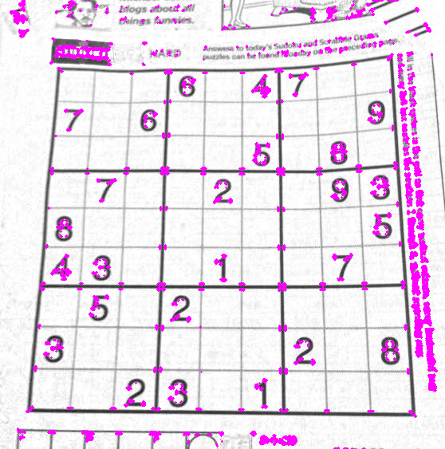
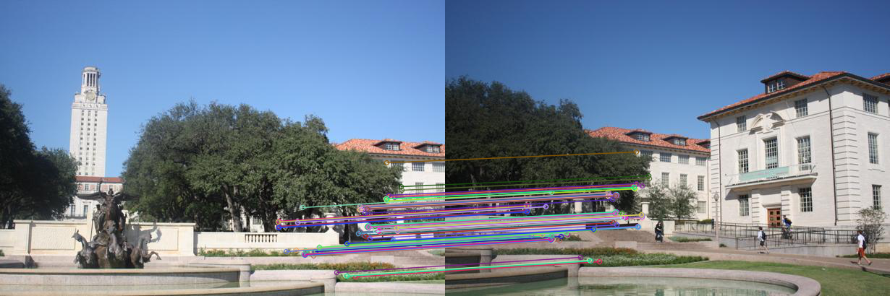
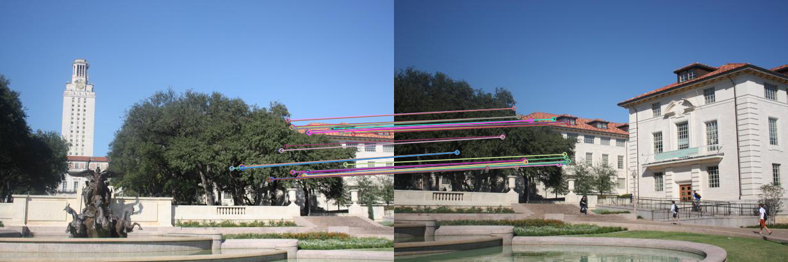
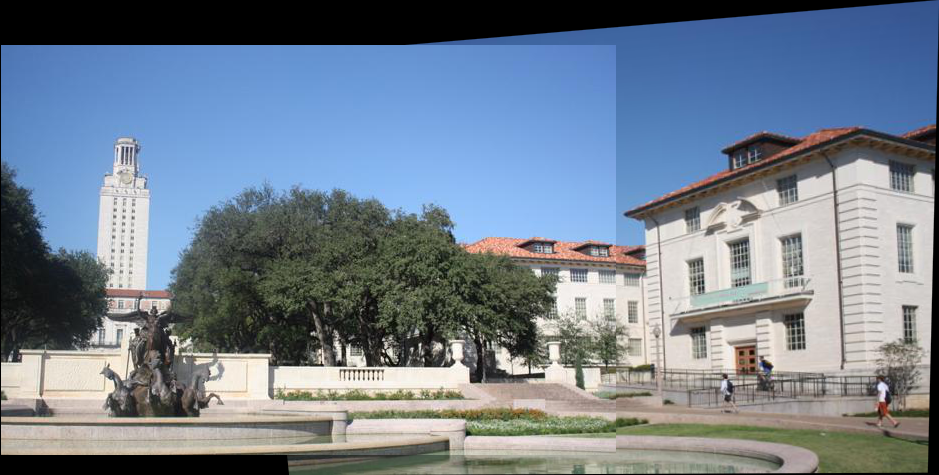
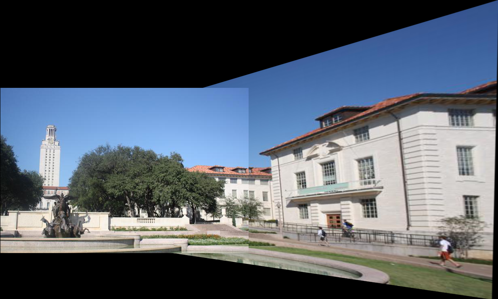
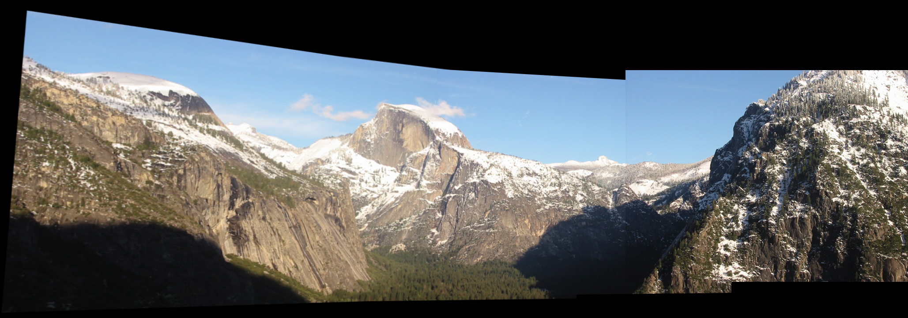

# **全景图拼接**

#### Harris角点检测 + SIFT/HOG描述子 + RANSAC

+ require____实验要求

+ code____代码 
+ report_tex____实验报告
+ result____结果

### Harris角点检测

+ 由于Harris角点检测算法只能处理灰度图像，因此需要将图像转换为灰度图像

```
img = cv2.imread(image_path)
# print(img.shape) # (563, 558, 3)三通道
gray = cv2.cvtColor(img, cv2.COLOR_BGR2GRAY)
```

+ 使用Sobel算子计算图像的梯度，得到图像在x和y方向上的梯度

```
dx = cv2.Sobel(gray, cv2.CV_64F, 1, 0, ksize=3) 
dy = cv2.Sobel(gray, cv2.CV_64F, 0, 1, ksize=3)
```

+ 计算自相关矩阵 M 并 计算角点响应函数 R

```
Ixx = dx**2
Ixy = dy*dx
Iyy = dy**2
k = 0.04
# 使用高斯滤波器对自相关矩阵进行平滑处理
M = cv2.GaussianBlur(Ixx, (5, 5), 0) * cv2.GaussianBlur(Iyy, (5, 5), 0) - cv2.GaussianBlur(Ixy, (5, 5), 0)**2
R = M - k * (Ixx + Iyy)**2
```

+ 非极大值抑制，设置阈值为最大响应值的2%并在原图中绘制出角点进行可视化

```
R_max = np.max(R)
threshold = 0.02 * R_max # 设定阈值为最大响应值的2%
corner_img = img.copy()
for i in range(img.shape[0]):
    for j in range(img.shape[1]):
        if R[i, j] > threshold:
            # 画出角点，参数分别为图像，圆心坐标，半径，颜色，线宽
            cv2.circle(corner_img, (j, i), 1, (255,0,255), -1)
```



### **关键点描述与匹配**

#### SIFT特征和匹配

+ SIFT特征算法的原理已经在 \ref{} 一节详细阐述，对SIFT特征的计算可以通过opencv库的指定方法简单实现。使用Harris角点坐标创建cv2.KeyPoint对象，把关键点和灰度图传入sift.compute方法可以实现SIFT描述子的计算。

+ 在邻域大小为2、Sobel算子孔径大小为3、k为0.04的角点参数设置下，以0.01倍最大响应值为阈值，可以看出每幅图片计算了约四千到五千个角点。每个角点以半径为5的领域计算了128维的SIFT特征向量。


+ 主要的代码流程如下：

```python
# 根据已经有的角点坐标进行SIFT特征提取
def sift_feature_extraction(image_path, corner_location):
    img = cv2.imread(image_path)
    gray_img = cv2.cvtColor(img, cv2.COLOR_BGR2GRAY)
    # 使用SIFT算法提取特征 corner_location:(N, 2)
    sift = cv2.SIFT_create()
    keypoints = [cv2.KeyPoint(float(x[1]), float(x[0]), 5) for x in corner_location]
    keypoints, descriptors = sift.compute(gray_img, keypoints)
    # print("sift keypoints shape:", keypoints.shape)
    # print("sift descriptors shape:", descriptors.shape)
    return keypoints, descriptors
```

+ 在得到每个角点（关键点）的128维SIFT特征向量后，可以进行两幅图像的特征向量匹配。流行的向量匹配器包括：
	1. **Brute-Force Matcher（暴力匹配器）**：最简单的特征匹配方法之一。它会计算两组特征向量之间的所有对应关系，并通过一些阈值或距离度量来确定最佳匹配。虽然简单，但在特征数量较大时计算量很大，因此不太适合大规模应用。
	2. **FlannBasedMatcher（FLANN 匹配器）**：基于 FLANN（Fast Library for Approximate Nearest Neighbors）的匹配器，使用了一种快速的最近邻搜索算法。FLANN 匹配器可以有效地处理大规模特征数据集，速度比暴力匹配器快。但 FLANN 匹配器对参数的设置和调整相对较复杂。
	3. **KNNMatcher（K-最近邻匹配器）**：KNN 匹配器会为每个特征点找到 k 个最近邻的匹配点。这种匹配器可以在某些情况下提供更好的匹配结果，但也可能引入一些错误匹配。
+ 本实验中，由于数据规模比较小（只有数千个数据点），所以我选择使用了Brute-Force匹配器，它会暴力匹配和计算两组特征向量之间的所有对应关系，并通过距离阈值来确定最佳匹配。opencv有Brute-Force匹配器的库方法，直接传入前一步计算的描述子向量即可，主要代码如下：

```python
	# 使用Brute-Force匹配器，对特征点进行匹配
    bf = cv2.BFMatcher(cv2.NORM_L2, crossCheck=True)
    matches = bf.match(descriptors1, descriptors2)
    print("bf_matcher_out_len", len(matches))
```

+ 对于匹配结果，我手动选取和截断了匹配最优的10/100/1000个匹配点，并在两幅图像中进行匹配和可视化。

```python
    # 根据距离排序，只保留前n个匹配
    n = 10/100/1000 
    matches = sorted(matches, key = lambda x:x.distance)[:n]
    print("out_max_distance", matches[n-1].distance)

    # 绘制匹配结果
    img1 = cv2.imread(image1_path)
    img2 = cv2.imread(image2_path)
    img_matches = cv2.drawMatches(img1, keypoints1, img2, keypoints2, matches, None, flags=cv2.DrawMatchesFlags_NOT_DRAW_SINGLE_POINTS)
```




### HOG特征和匹配

+ HOG特征算法的原理已经在 \ref{} 一节详细阐述，对HOG特征的计算也可以通过opencv库的指定方法简单实现。

+ 主要的计算依赖于hog.compute方法，主要的参数是传入灰度图和角点坐标，该方法会根据默认的窗口大小winSize和窗口步长winStride来计算HOG特征向量。默认的winSize为128\*64，winStride为8\*8，在本实验中，该默认参数的效果良好。

```python
hog = cv2.HOGDescriptor()
des_hog = hog.compute(gray, locations=corner_location_tuple).reshape(corner_location.shape[0], -1)
```

+ HOG特征提取的结果如下图所示，可以看出对于每个角点提取了3780个特征向量；由于HOG特征向量在本实验的精度不高，实验发现有许多向量为纯零向量。


+ 在特征匹配时，由于纯零向量的存在，如果进行暴力一对一匹配会出现许多无效数据匹配点；所以在匹配HOG特征时考虑使用基于 L2 范数的**knnMatch**，它在两组特征描述子之间进行 k 近邻匹配。在给定描述子集合中，对于每个描述子，它会找到另一组中 k 个最接近的描述子。我设置k为2，并设置最优匹配相对于次优匹配至少具有95%的距离优势，才认为最优匹配是可靠的。

```python
    bf = cv2.BFMatcher(cv2.NORM_L2)
    matches = bf.knnMatch(descriptors1, descriptors2, k=2)
    # 选择最佳匹配
    good = []
    for m, n in matches:
        if m.distance < 0.95 * n.distance:
            good.append(m)
    matches = good
```

+ 使用如上方法可以对HOG特征筛选数十个匹配点对，对于匹配结果可以可视化如下。




### 实现图像拼接

+ 使用 RANSAC 求解仿射变换矩阵，实现图像的拼接

+ 要实现同一场景不同视角的图像拼接，可以通过对匹配点对（即同一地点的不同视角下在不同图像上的坐标）计算透视变换矩阵实现。

+ 从前面得到的match点对中复原出关键点点对的图像坐标，并依赖于这些坐标计算透视变换矩阵。透视变换矩阵描述了从源图像到目标图像的投影变换关系。通过它可以使图像进行对齐和匹配。
+ 在求解透视变换矩阵使用了RANSAC方法，RANSAC可以接受具有噪声的匹配点对，通过迭代的方法可以终选择具有最大一致性的子集产生的变换矩阵作为最终的估计。对于噪声的处理可以有效提高图像拼接的准确度和效果。

```python
    src_pts = np.float32([keypoints1[m.queryIdx].pt for m in matches]).reshape(-1, 1, 2)
    dst_pts = np.float32([keypoints2[m.trainIdx].pt for m in matches]).reshape(-1, 1, 2)
    # 计算透视变换矩阵
    M, mask = cv2.findHomography(dst_pts, src_pts, cv2.RANSAC, 5.0)
```

+ 计算平移矩阵，来确保拼接的第二幅图像位置合适；并使用cv2.warpPerspective方法传递矩阵参数M计算透视变换图像并进行拼接。

```python
    translation_matrix = np.array([[1, 0, -x_min], [0, 1, -y_min], [0, 0, 1]])
    M = np.dot(translation_matrix, M)
    result = cv2.warpPerspective(image2, M, (x_max - x_min, y_max - y_min))
    result[-y_min:h1 - y_min, -x_min:w1 - x_min] = image1
```

+ 对于SIFT和HOG两种不同的特征计算和匹配得到的效果如下图所示:

#### 基于SIFT描述子拼接效果：



#### 基于HOG描述子拼接效果：




+ **效果分析：可以明显看出使用SIFT特征的效果要优于HOG特征，推测原因可能有以下几点：**
	1. SIFT描述子具有更多的匹配点对。本实验中，由于SIFT特征使用的是一对一匹配，求出并使用了上千个数据点对。但是由于HOG特征向量具有稀疏性（需要为全零向量），只能使用knn进行匹配，在95%的最优阈值下只能找到几十个匹配点对。毫无疑问更多的点对具有更高的精度。
	2. SIFT 描述子具有很强的几何不变性和光照不变性，能够更好地描述图像的局部特征，对图像旋转、缩放和视角变化具有较好的鲁棒性，因此在匹配过程中更容易找到正确的对应关系；HOG描述子受到亮度影响较大，并且在本实验中没有进行Gamma矫正或者直方图均衡化等预处理操作。


# 多图像拼接

+ 对于四幅图像的拼接可以采用递归的方式，即使用图片n-1和图片n的拼接结果和图片n+1进行操作。考虑到图片顺序的问题，可以使用图片之间的match点对的数量来判断拼接两张图片是否合理，即在匹配点对数量较少时考虑到图片可能不直接相连来避免此拼接顺序。
+ 下面显示了实验要求中的四幅图像递归拼接的效果：




### 参考资料：

[角点检测：](https://www.cnblogs.com/zyly/p/9508131.html#_label3)

[Umich EECS 442 (Winter 2018) Homework 4：](https://github.com/xuwenzhe/EECS442-Image-Stitching/tree/master)